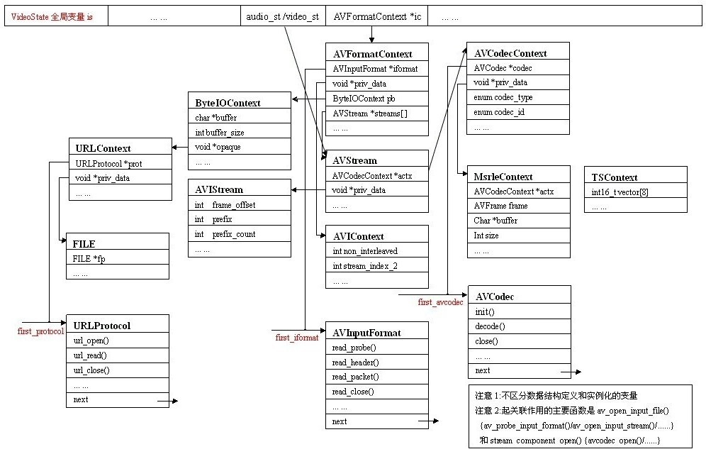

## ffmpeg主要数据结构之间的联系



​									    图一

#### VideoState

​	**ffplay**中定义的总控结构，把其他核心数据结构整合在一起，起一个中转的作用，便于在各个子结构之间跳转。

#### AVInputFormat

​	**libavformat**中定义的结构,一种文件容器格式对应一个AVInputFormat结构，在程序运行时有多个实例。

#### ByteIOContext

​	**libavformat**中定义的结构，扩展URLProtocol结构成内部有缓冲机制的广泛意义上的文件，改善广义输入文件的IO性能。通过内部字段opaque跟URLProtocol结构关联。

#### URLContext

​	**libavformat**中定义的结构,表示程序运行的当前广义输入文件使用的上下文。

#### AVStream

​	**libavformat**中定义的结构，表示当前媒体流的上下文，着重于所有媒体流共有的属性(并且是在程序运行时才能确定其值)和关联其他结构的字段。

#### AVFormatContext

​	**libavformat**中定义的结构,表示程序运行的当前文件容器格式使用的上下文，着重于所有文件容器共有的属性(并且是在程序运行时才能确定其值)和程序运行后仅一个实例。

​	**av_open_input_file** （该接口已经被avformat_open_input替换）中对AVFormatContext结构进行初始化工作。

```c
// 打开输入文件，并识别文件格式，然后调用函数识别媒体流格式。
int av_open_input_file(AVFormatContext **ic_ptr, const char *filename, 
                      AVInputFormat *fmt, int buf_size, AVFormatParameters *ap)
```
